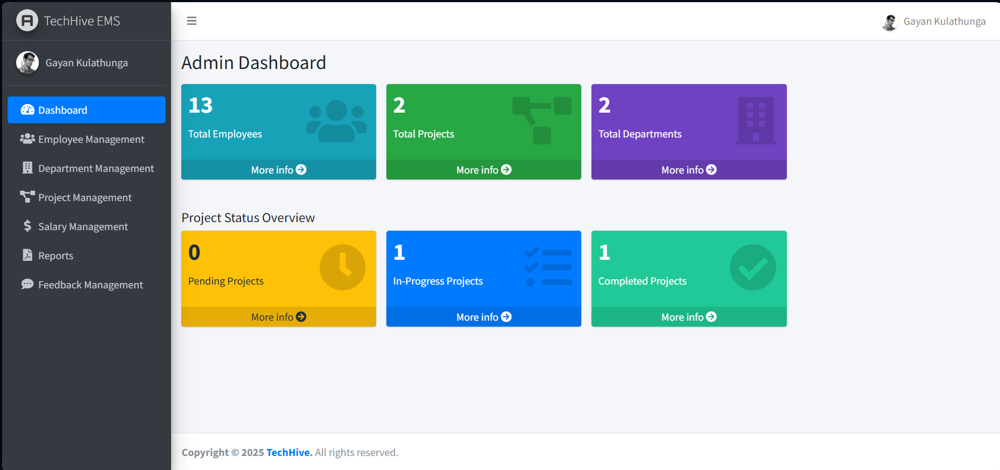
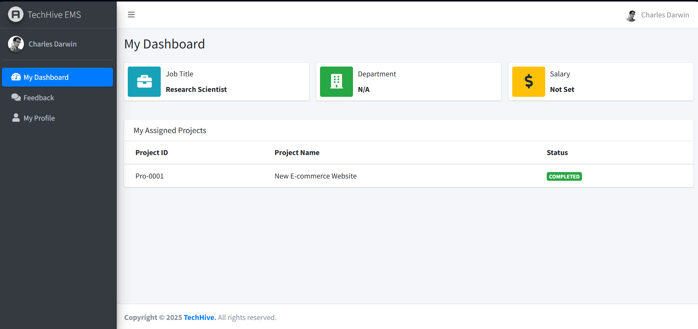
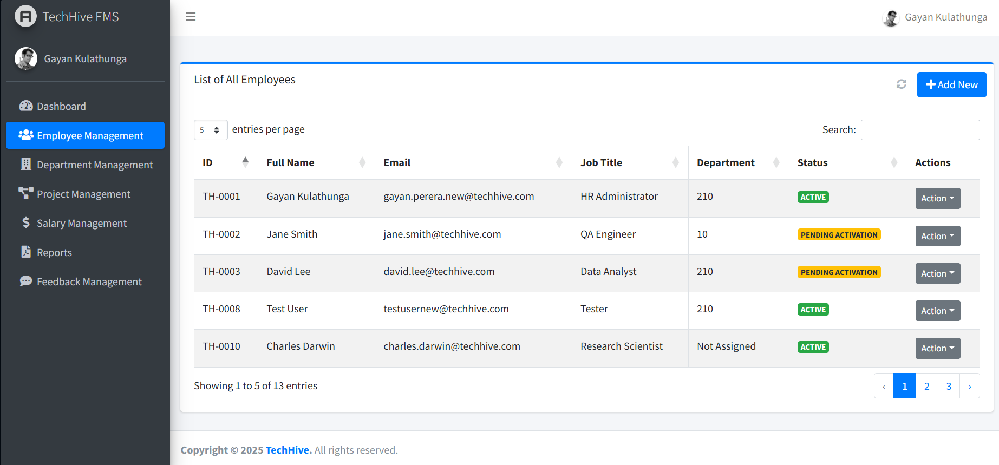
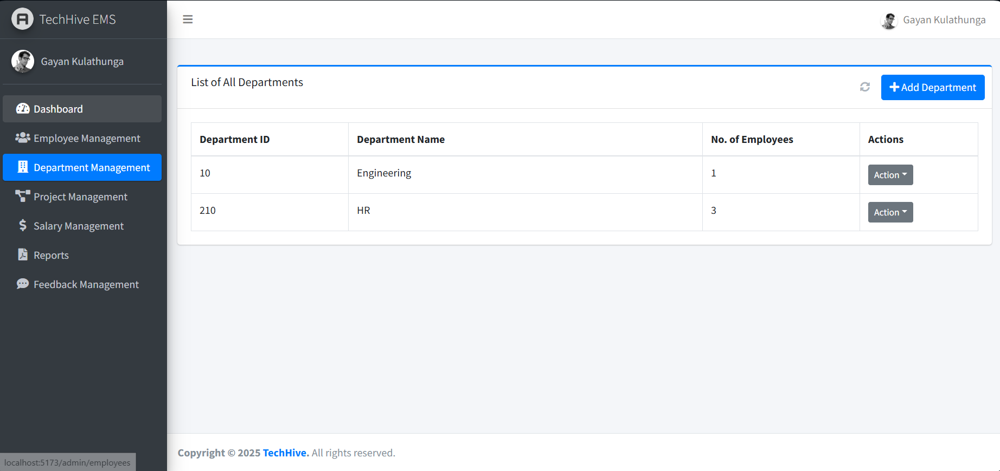
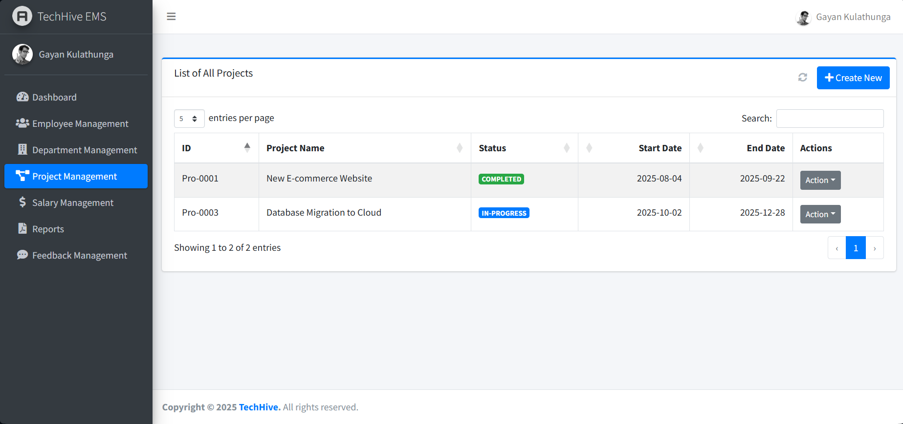
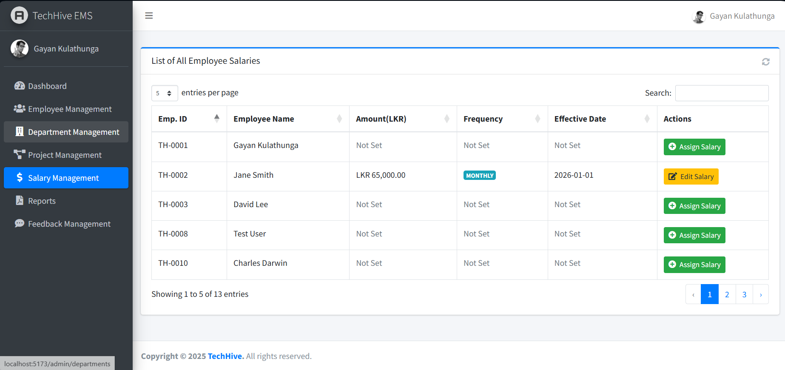
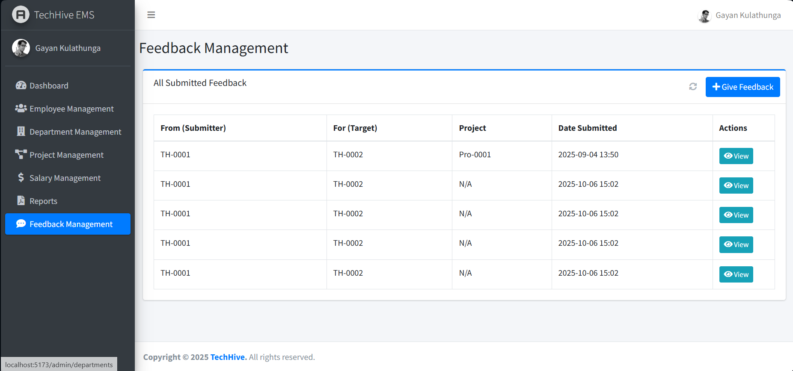
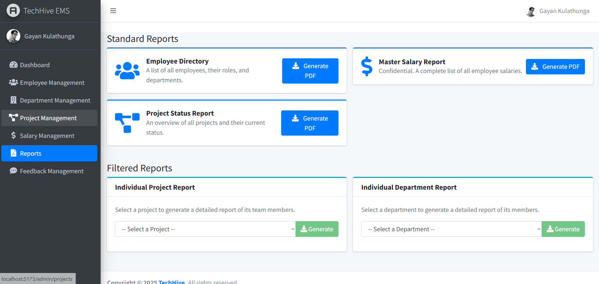
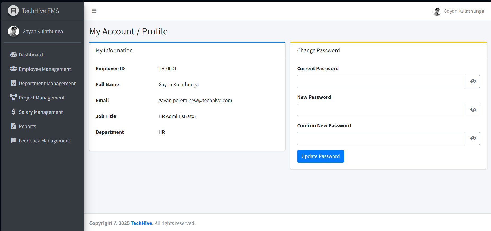
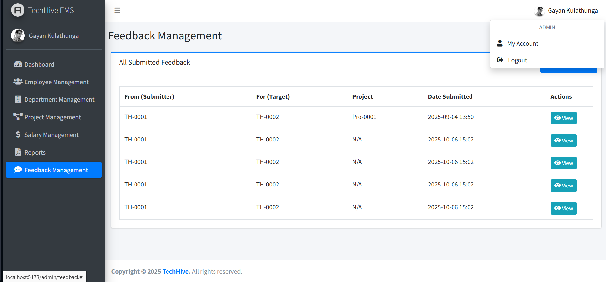

# TECH-HIVE Employee Management System (EMS)

A scalable, enterprise-grade **Full-Stack Employee Management System** designed using a modern **microservices architecture**. The system enables administrators to manage employees, departments, projects, salaries, and reports, while providing employees with a secure, personalized self-service portal.

---

## Table of Contents

- Project Overview
- Key Features
- System Architecture
- Technology Stack
- Installation & Setup
- Application Workflow
- Security Model
- Reporting Capabilities
- Future Enhancements
- License

---

## Project Overview

This project demonstrates the design and implementation of a real-world, enterprise-style application with clear separation of concerns, secure authentication, and scalable backend services. The system follows industry best practices such as:

- Microservices-based backend design
- API Gateway pattern
- Role-based access control
- Dual-database strategy (Relational + NoSQL)
- Secure, stateless authentication

The application is suitable for academic projects, portfolio demonstrations, and as a reference architecture for enterprise Java full-stack systems.

---

## Key Features

### Administrator Capabilities

- Secure, role-based authentication (JWT)
- Centralized administrative dashboard with key metrics
- Full CRUD operations for:

  - Employees
  - Departments
  - Projects

- Employee-to-project team assignment
- Salary management and updates
- Organization-wide feedback monitoring
- Automated PDF report generation, including:

  - Employee directory
  - Salary master list
  - Project status reports
  - Department and project rosters

### Employee Capabilities

- Secure login and first-time account activation
- Personalized dashboard displaying:

  - Department details
  - Assigned projects
  - Salary information

- Profile and password management
- Internal feedback submission and review

---

## 📸 Project UI Screenshots

<details>
<summary><strong>Click here to view Application Screenshots</strong></summary>

### 1. Dashboards

**Admin Dashboard** - Key metrics and quick actions.


**Employee Dashboard** - Personalized view for staff.


---

### 2. Administrative Modules

**Employee Management** - List and manage staff records.


**Department Management** - Manage organizational structure.


**Project Management** - Oversee projects and timelines.


**Salary Management** - Secure salary administration.


---

### 3. Feedback & Reports

**Feedback Management** - Monitor internal feedback.


**Reporting Center** - Generate PDF reports.


---

### 4. User Profile & Security

**My Profile** - User details and password management.


**Secure Logout** - Confirmation modal.


</details>

---

## System Architecture

The application is implemented using **loosely coupled microservices**, all exposed through a centralized **API Gateway**.

---

### Microservices Overview

- **API Gateway** – Central entry point, request routing, and JWT validation
- **Authentication Service** – User authentication, onboarding, and token management
- **Employee Service** – Core HR data (employees, departments, salaries)
- **Project Service** – Project management and team assignments
- **Reporting Service** – Dynamic PDF report generation
- **Feedback Service** – Feedback management using a NoSQL database

Each service is independently deployable and communicates via RESTful APIs.

---

## Technology Stack

### Backend

- Java 21
- Spring Boot 4
- Spring Security
- JSON Web Tokens (JWT)
- Maven

### Databases

- **Oracle XE** (Primary relational database)

  - Business logic implemented entirely using **PL/SQL stored procedures and functions**

- **MongoDB** (NoSQL database for feedback data)

### Frontend

- React 18
- Vite
- AdminLTE 3
- React Router
- Axios
- React-Bootstrap
- React-Toastify
- jQuery DataTables

---

## Installation & Setup

### Prerequisites

- Java JDK 21 or later
- Apache Maven 3.8+
- Oracle XE Database
- MongoDB (Local or Atlas)
- Node.js 18+ and npm
- Git

---

### Database Configuration

#### Oracle Database

1. Connect as a privileged user (e.g., SYSTEM).
2. Execute the script:

   ```sql
   /database-scripts/01-oracle-schema-setup.sql
   ```

3. This script creates:

   - Database user
   - Tables, sequences, triggers
   - Stored procedures and functions

4. Update database credentials in all backend `application.properties` files.

#### MongoDB

- Ensure MongoDB is running.
- Update the MongoDB connection URI in the `feedback-service` configuration.
- The database and collections are auto-created at runtime.

---

### Backend Services Setup

Each microservice is a standalone Spring Boot application.

1. Navigate to the `/Backend` directory.
2. Open each service in your IDE.
3. Allow Maven dependencies to resolve.
4. Verify:

   - Server ports
   - Database credentials

5. Run all services individually.

---

### Frontend Setup

```bash
cd EMS_Frontend
npm install
npm run dev
```

Access the application at:

```
http://localhost:5173
```

---

## Application Workflow

1. Administrator creates employee records.
2. System generates a temporary password.
3. Employee activates the account via the onboarding screen.
4. Authenticated users access role-specific dashboards.
5. All API requests are routed and validated through the API Gateway.

---

## Security Model

- Password hashing using BCrypt
- Stateless authentication using JWT
- Role-based access control (Admin / Employee)
- API Gateway enforcement for token validation
- Database access restricted via stored procedures

---

## Reporting Capabilities

The system supports automated generation of professional PDF reports:

- Organization-wide employee directory
- Salary summaries
- Project-level team allocations
- Department-wise employee listings

Reports are generated dynamically based on real-time data.

---

## Future Enhancements

- Docker and Kubernetes deployment
- CI/CD pipeline integration
- Email notifications
- Audit logging
- Performance monitoring and tracing
- Advanced analytics dashboards

---

## License

This project is intended for educational and demonstration purposes. Licensing terms may be defined based on future usage or distribution requirements.
